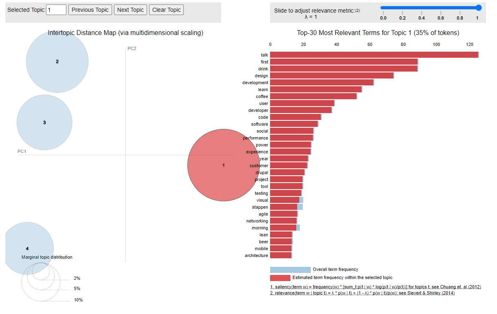
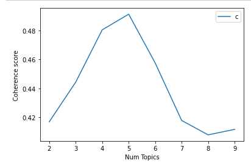

#RSVP Prediction

## Context: meetup.com

[Meetup.com](http://www.meetup.com) is a popular online platform with the aim of bringing together people with a shared interest in real-life events (meetups).
The meetup community is composed of groups, where each group has a particular interest and organises events.
Users of meetup.com can become member of one or more groups.
Whenever a group organises an event, members of that group have the opportunity to RSVP for an event (yes, we're using RSVP as a verb here).
The RSVP for an event can be either a Yes or No answer, meaning respectively that the member is either planning to attend the event or is not.
Not RSVP-ing to an event can be interpreted as a No.
Additionally, groups express the interests that they ostensibly have in terms of a number of topics

In summary, the essential entities and relations in the meetup.com ecosystem are:

- Users can join groups (becoming members)
- Groups have an organiser
- Groups discuss a set of topics
- Groups organise events
- Members can RSVP to events (Yes or No)
- An event is hosted at a venue

Apart from these basics, both groups, users, members, events and venues have particular metadata.

A special case of meetup events are what we call tech meetups.
These are events focussing on technology (usually Information Technology / software engineering / computer science), with a typical conference style setup, where there are presentations and the members that attend are audience.
Tech meetups are generally organised with the goal of knowledge sharing within the professional IT community.
However, since these events are often attended by individuals with relevant and sometimes scarce skills in what are considered cutting edge technologies, these events are also popular targets for sponsorships from organisations who are actively hiring software engineers or data scientists.

## Assignment: Predictive API

The goal of the technical assignment is to create a REST web service that will take data for a new, to be organised, meetup event and predict how many members will RSVP to that meetup.
This is useful for organisers to investigate whether minor changes to their event (e.g. event date / day of week) will have a positive influence on the number of expected attendees.
We want you to create a model that predicts the number of Yes RSVPs and integrate it into a provided API framework.

```
Models are built using Jupyter Notebook. The models and some dictionaries were exported to the app folder and used inside the API.
Meet-up RSPV Prediction_Final_Version.ipynb has all the data processing and model building steps. 
```

```
For this project, a conda environment is created and used. requirements.txt lists all the libaries within the environment.
```
##Data Wrangling

To make the data more understandable I derived new fields from existing ones.

Following steps applied:

1. **Obtaining total number of user count that belongs to each group:** *Users.json* has the information of **"membership"**. In membership, there is a unique identifier of the group that the user has joined. From this information, we obtain the total user number for each group. For testing, we export this as a dictionary.

2. **Obtaining event day and event time from the epoch time field:** Event time is given in epoch format. To make it more human readable and to check the effect of time on the target variable, we obtain name of the day (e.g. Saturday), and the hour information from the given event time.

3. **Finding the difference between event creation time, and the event time:** The difference between event creation time and planned event time is valuable because the earlier event is announced the more people will see it and potentially rsvp more.

4. **Obtaining the target variable yes_rsvp:** *Events.json* file has a field called **rsvps**. This object contains response variable which is the indication of whether user will attend the event. We want to predict rsvp_yes count for the given event. Hence, we obtain target variable for each event.

5. **Topic Modelling:** See the section Topic Modelling

##Data Cleaning

1. Finding and imputing missing values

    1.1. Filling user count with 0 if its NULL

    1.2. Filling Duration with mean duration if its NULL

    1.3. Filling rsvp_limit with 999 if its NULL

2. Cleaning the event description and event name fields from HTML, JavaScript tags.

3. Changing the format of the duration from ms to h.

4. Only including the past events.

5. Looking for outliers

   5.1. Remove the cases that have rsvp_count_yes as 0

## Topic Modelling

Topic Modeling is a technique to extract the hidden topics from large volumes of text. Latent Dirichlet Allocation(LDA) is a popular algorithm for topic modeling with excellent implementations in the Python’s Gensim package. The challenge, however, is how to extract good quality of topics that are clear, segregated and meaningful. This depends heavily on the quality of text preprocessing and the strategy of finding the optimal number of topics.


In the case of rsvp prediction, we are interested to use description and event name as model inputs. To do that, it is needed to understand what the event is about. To find the keywords of the vent, we will use topic modelling

Steps:

1. **Prepare the stopwords:** I used English and Dutch stopwords for this analysis. Apart from that, I extended the list of stopwords with some words that occur in most of the documents. 
```
stopwords_extension: ['join', 'meet', 'event', 'attend', 'time', 'day', 'week', 'group','pm', 'am',
                  'rsvp', 'come', 'register', 'contact','welcome','member', 'session',
                  'schedule', 'get', 'meetup','th', 'yet', 'also' ,'let', 'lets', 'events', 'able', 'via']
```
2. **Tokenize words**

3. **Creating bigram models:** Bigrams are two words frequently occurring together in the document.

4. **Remove stopwords, make bigrams and lemmatize** 

5. **Create the dictionary and Corpus:** The two main inputs to the LDA topic model are the dictionary(id2word) and the corpus.

6. **Build the topic model:** With the created dictionary and corpus, I trained the LDA model

7. **Compute model coherence score:** LDA model also expects the number of topics as an input. So to select the most optimal number of topic, I computed the coherence score for some candidate number of topics and selected the one that gives the highest coherence score.

8. **Visualize the topic-keyword**  pyLDAvis package’s interactive chart is used to visualize the topics


Above is the chart displaying topics for event description.



Above is the chart displaying topics for event name.

9. **Find optimal number of topics for the model** Different number of topics tested, and the one which gives the highest coherence score is selected.



10. **Find dominant topic for each description** For each event description and event name, dominant topics are found.


## Data Exploration

Extended data exploration is required to understand how the given dataset looks like and how we can use it to build a good prediction model.


First look the completeness of the dataset.


From this chart, it seems that events have weekly pattern. We see the peak in every 7 days which corresponds to Wednesday and Thursdays.


From this chart, it seems Wednesdays and Thursdays are the days people rsvp more


According to this chart, for the events that starts at 19 people rsvp more.


People seem to rsvp more on Wednesdays,Tuesdays and Thursday at 19:00


From this chart, there is not any significant effect duration has on rsvp_count


### Target Investigation


## RSVP Prediction Model

1. **Split Train-Test:** Test size is selected as 0.33 since the dataset used to train the model is not big. By increasing the test size, I tried to avoid overfitting.

2. **Filter the dataset to only contain valuable fields. (Based on the domain knowledge)** I removed the origin fields that derived fields are based on. For instance instead of using event time in the model, I used event day and event time. 

3. **Check target feature distribution**


The target is right skewed so, we should apply log transformation to convert its distribution to normal distribution.


The above is showing the log transformation applied target distribution.

4. **Check the correlation between numeric fields**


There is no correlation between the numeric fields. (There used to be a correlation between user_count and group_age and I decided to remove the group_age since it gives the same information as user_count)

5. **Check the correlation between rsvp_count_yes and the other numeric features**


From this char, we see Even_Description_Length and user_count have the positive correlation with the target variable while rsvp_limit has negative correlation.

6. **Check pairplots**


7. **Apply feature engineering**
   
   * Log transform target variable
   
   * Log transform skewed numeric features (More than 0.75): 

   * Apply one-hot encoding to categorical variables.
   

8. **Build different regression models and validate them**

* LASSO Regression

* Elastic Net Regression

* Kernel Ridge Regression

* Gradient Boosting Regression

* Random Forest Regression

* XGBoost 

9. **Find the optimal model based on RMSE.** 

* LASSO Regression 

```
Lasso score: 0.6276 (0.0156)
```
* Elastic Net Regression

```
ElasticNet score: 0.6257 (0.0155)
```

* Kernel Ridge Regression

```
Kernel Ridge score: 0.6014 (0.0181)
```

* Gradient Boosting Regression

```
Gradient Boosting score: 0.5913 (0.0178)
```

* Random Forest Regression

```
Random Forest score: 0.5392 (0.0155)
```
* XGBoost 

```
Xgboost score: 0.5361 (0.0137)
```

XGBoost regression gives the least RMSE. Hence, I decided to proceed with XGBoost regression.

10. **Grid search for the optimal parameters for the selected model:** Different hyperparameters are tried within grid search and the best ones are selected to be used in the model. To avoid overfitting, 3-fold cross validation is applied. 


11. **Build the model on training data with the most optimal model parameters.** Selected hyperparametes are put in the XGBoost model.


12. **Check the feature importance.** 


Event_Notice parameter is the most important one among model parameters.

13. **Define regularized quantile loss function for the confidence interval.**


 The function above defines the logcosh quantile regression objective log_cosh_quantile, that computes its gradient and the hessian. Those are required to minimize the objective.
14. **Build upper and lower prediction model with different loss functions.**

 90% confidence interval will be computed. Hence, alpha=0.95 is used for the upper bound, and alpha=0.05 is used for the lower bound to build two different models.


## API

The API takes a GET request and respond with the expected number of Yes RSVPs with  lower and upper bounds.

The prediction endpoint takes a number of parameters in the GET request.

These are passed as querystring parameters in the request URL. Not all of these parameters are mandatory in all requests.


```
GET /api/some-url?param1=value&param2=value...&paramN=value
```

The modules of the application:
* app.py
* ModelAccessor.py
* InputProcessor.py
* TopicModellingService.py

###app.py

It runs the flask application and contains the API endpoint logic

### ModelAccessor.py

This module loads and initialize the pre-created models.

### InputProcessor.py
This module is responsible for the following,

1. **process_and_validate_input:** This method validates the querystring parameters. If they are not valid, it throws bad request error

   * All required parameters should be in querystring otherwise, it throws bad request error.
   
   * Time parameter is required, and it should be parsed as integer. It changes the type of time to int.
   
   * It parses optional parameters as integers (["venue_id", "duration", "rsvp_limit"])

2. **transform_input:** This method transforms the input parameters. It creates a dictionary that have the model inputs as keys. (Parameters that trained the model)

   * **transform_event_day:** Event day is obtained from the time parameter and since the event day is categorical variable, One-Hot encoding is applied to it. (e.g. it assigns event_Day_0 as 1 in the dictionary if the event is supposed to happen on Monday. For the rest of the days it assigns 0 in the dictionary.)
 
   * **transform_event_hour_and_notice:** Event time is obtained from the time parameter. One Hot encoding is applied. Also, Event_Notice is calculated by taking the difference of given time and now. If the event time is in the past then it assigns 24h instead.
   
   * **transform_venue_and_group:** Venue is optional parameter, so if it's not given in querystring (or if it's empty) it is filled with the most frequent id for the given group id. Then both venue and group are applied One-Hot Encoding since they are categorical variables. In this step, user_count is obtained from a pre-created dictionary based on the given group id.
   
   * **transform_event_desc_and_name:** First, event description and name are cleaned from all the html and javaScript tags. Then, Dominant topic group is found for the given event description, and the event name using two different pre-trained models. Since they are categorical, One-Hot Encoding is applied. Lastly, event description length is obtained from the given event description.

   * **transform_duration:** Duration is optional parameter. If it's not given, then the mean duration of events from training data is assigned instead.

   * **transform_rsvp_limit** rsvp_limit is optional parameter if it's not given then 999 is assigned meaning there is no limit.
   
```
It is important to apply log transformation to all the skewed fields from the training data. (['Event_Notice', 'Event_Description_Length', 'duration', 'user_count'])
```
### TopicModellingService.py
This module is responsible to find the dominant topics from the event description and event name fields. See the Topic Modelling section for further explanation of the steps.


### Assumptions:
These are the assumptions, before parsing the parameters into querystring.

* Group id must be among the groups trained in the model.
* Venue id must be among the venues trained in the model. (It can also be empty)
* Event Name and description must be encoded before the querystring.
* Event time must be in the future.
### Example Result

* http://127.0.0.1:8080/api/rsvp-prediction?group=The-Dutch-Cpp-Group&name=Hot%20C++,%20Part%202:%20Universal%20references%20and%20New%20style%20of%20passing%20arguments&description=events.iloc%5B498%5D%5B%27description%27%5D%0A%27%3Cp%3EOur%20last%20Meetup%20Andrey%20Upadyshev%20spoke%20about%20Rvalue%20references%20and%20move%20semantics%2C%20and%20we%20ran%20a%20bit%20out%20of%20time.%20Fortunately%20we%20now%20can%20have%20a%20second%20Meetup%20about%20the%20topics%20he%20also%20prepared%20for%20the%20last%20Meetup%3A%20universal%20references%20and%20new%20style%20of%20passing%20arguments.%3C%2Fp%3E%20%3Cp%3E%3Cb%3EProgram%20for%20Thursday%209th%20of%20July%20Meetup%20%3C%2Fb%3E%3C%2Fp%3E%20%3Cp%3E7%20pm%20%28%2A%29%20-%20Beer%20and%20pizza%3Cbr%2F%3E7.45%20pm%5Cxa0%20-%20Introductions%3Cbr%2F%3E8%20pm%5Cxa0%20-%20Universal%20references%20--%20Andrey%20Upadyshev.%3Cbr%2F%3E8.30%20pm%20-%20Discussion%20%2F%20short%20break%3Cbr%2F%3E8.50%20pm%20-%20New%20style%20of%20passing%20arguments%20--%20Andrey%20Upadyshev.%3Cbr%2F%3E9.15%20pm%20-%20Discussion%20and%20social%20%28until%2010%20pm.%29%3C%2Fp%3E%20%3Cp%3E%3Ci%3E%28%2A%29%20Note%20that%20you%20don%5C%27t%20need%20to%20arrive%20%2Astrictly%2A%20at%2019%3A00%2C%20you%20are%20welcome%20from%2019%3A00%2C%20but%20we%5C%27ll%20start%20~19%3A45%2C%20if%20you%20can%20make%20it%20around%20that%20time%2C%20that%5C%27s%20good%20enough%21%5Cxa0%3Cbr%2F%3E%3C%2Fi%3E%3C%2Fp%3E%20%3Cp%3E%3Cb%3ESpeaker%3C%2Fb%3E%3C%2Fp%3E%20%3Cp%3E%3Cbr%2F%3EAndrey%20Upadyshev%20is%20a%20developer%20and%20architect%20with%20more%20than%2010%20years%20of%20C%2B%2B%20commercial%20development%20experience%20and%20a%20few%20years%20of%20Python.%20He%20has%20designed%20and%20implemented%20projects%20in%20different%20areas%20including%20financial%2C%20networking%2C%20corporate%20security%20and%20many%20others.%20Currently%20works%20at%20Satprof%20company.%3C%2Fp%3E%20%3Cp%3E%3Cb%3ELocation%5Cxa0%20%3C%2Fb%3E%3C%2Fp%3E%20%3Cp%3E%3Cimg%20src%3D%22http%3A%2F%2Fphotos3.meetupstatic.com%2Fphotos%2Fevent%2Fd%2F7%2F2%2F0%2F600_324235072.jpeg%22%20%2F%3E%3C%2Fp%3E%20%3Cp%3EThe%20Meetup%20will%20be%20hosted%20by%20Copernica%2C%20which%20is%20a%20few%20minutes%20walk%20from%20Amsterdam%20Central%20Station.%20The%20address%20is%20%3Ca%20href%3D%22https%3A%2F%2Fgoo.gl%2Fmaps%2F6HJnS%22%3EDe%20Ruijterkade%20112%2C%20Amsterdam%20%28click%20for%20google%20maps%29%3C%2Fa%3E.%3C%2Fp%3E%27&time=1623351277000&venue=68158

Returns to :


* http://127.0.0.1:8080/api/rsvp-prediction?group=BitcoinWednesday&name=nd%20year%20anniversary%20free%20bitcoin%20wednesday%20conference%20amsterdam&description=bitcoin%20wednesday%20amsterdam%20second%20year%20anniversary%20party%20register%20here%20meetupcombitcoinwednesday%20to%20reserve%20your%20place%20new%20location%20vondelcs%20in%20the%20beautifully%20restored%20landmark%20vondelpark%20pavilion%20minutes%20away%20from%20leidesplein%20right%20in%20the%20heart%20of%20amsterdam%20the%20address%20is%20vondelpark%20vondelcs%20is%20the%20new%20media%20culture%20and%20broadcast%20center%20in%20amsterdam%20for%20the%20avrotros%20national%20broadcasting%20company%20well%20have%20our%20own%20bar%20and%20exclusive%20space%20for%20a%20benefit%20dinner%20right%20before%20the%20program%20begins%20please%20mail%20maskedif%20youd%20like%20to%20reserve%20a%20space%20at%20the%20table%20the%20year%20anniversary%20celebration%20will%20include%20vincent%20everts%20one%20of%20the%20countrys%20most%20prominent%20trendwatchers%20on%20national%20radio%20and%20television%20on%20the%20use%20of%20the%20blockchain%20within%20organizations%20joshua%20scigala%20australian%20director%20of%20vaultoro%20presenting%20the%20types%20of%20transparency%20available%20to%20bitcoin%20users%20ruben%20de%20vries%20cto%20of%20blocktrail%20explaining%20the%20basics%20of%20multisignature%20wallets%20corne%CC%81%20plooy%20software%20designer%20for%20the%20dutch%20semiconductor%20sector%20with%20a%20solution%20for%20improving%20bitcoin%E2%80%99s%20scalability%20aron%20van%20ammers%20cto%20and%20founding%20partner%20of%20blockstars%20on%20the%20possibilities%20opportunities%20and%20obstacles%20inherent%20in%20smart%20contracts%20and%20blockchain%20solutions%20for%20specific%20industries%20and%20much%20more%20bitcoin%20wednesday%20bestaat%20inmiddels%20jaar%20we%20nodigen%20jullie%20uit%20om%20dit%20samen%20met%20ons%20te%20vieren%20zoals%20uit%20twee%20jaar%20geschiedenis%20blijkt%20heeft%20bitcoin%20wednesday%20voor%20zowel%20beginners%20als%20gevorderden%20iets%20te%20melden%20op%20juli%20is%20het%20precies%20jaar%20geleden%20dat%20de%20eerste%20bitcoin%20wednesday%20plaats%20heeft%20gevonden%20in%20de%20afgelopen%20maanden%20heeft%20de%20nederlandse%20digital%20currency%20revolution%20heel%20veel%20veranderingen%20ondergaan%20en%20is%20een%20innovatieve%20en%20sterk%20groeiende%20ondertussen%20een%20van%20de%20grootste%20in%20europa%20groep%20geworden%20daarom%20zijn%20wij%20trots%20jullie%20te%20mogen%20uitnodigen%20tot%20een%20informatieve%20en%20feestelijke%20avond%20in%20het%20teken%20van%20cryptovalutas%20zoals%20verwacht%20staat%20meet%20greet%20centraal%20tijdens%20dit%20evenement%20veel%20bekendebitcoin%20wednesday%20collegas%20ontmoeten%20en%20verhalen%20van%20vroeger%20ophalen%20veel%20nieuwkomers%20leren%20kennen%20en%20toekomstvisies%20uitwisselen%20na%20een%20aantal%20presentaties%20en%20lightning%20talks%20is%20er%20volop%20gelegenheid%20tot%20netwerken%20plan%20in%20je%20agenda%20dat%20we%20woensdagavond%20ons%20melden%20waar%20we%20gezamenlijk%20een%20toost%20zullen%20uitbrengen%20op%20de%20toenemende%20rol%20van%20bitcoin%20in%20de%20nederlandse%20samenleving%20neem%20mee%20je%20buurvrouw%20of%20collega%20een%20rugtas%20voor%20bitcoins%20natuurlijk%20en%20een%20goed%20humeur%20voor%20de%20laatste%20nieuws%20en%20updates%20over%20het%20programma%20zie%20bitcoinwednesdaycom%20english%20bitcoin%20wednesday%20celebrates%20its%20nd%20year%20of%20consecutive%20monthly%20digital%20currency%20events%20held%20on%20the%20first%20wednesday%20of%20every%20month%20the%20biggest%20best%20and%20longestrunning%20regular%20conference%20on%20the%20digital%20currency%20revolution%20in%20the%20netherlands%20takes%20place%20on%20the%20first%20wednesday%20of%20every%20month%20july%20st%20will%20be%20our%20th%20edition%20marking%20almost%20to%20the%20day%20exactly%20years%20ago%20that%20the%20first%20what%20once%20started%20as%20a%20communitydriven%20meetup%20at%20the%20bar%20for%20about%20two%20dozen%20of%20the%20netherlands%20earliest%20bitcoin%20pioneers%20is%20now%20a%20free%20monthly%20conference%20for%20both%20beginners%20and%20experts%20and%20is%20growing%20into%20one%20of%20the%20largest%20events%20of%20its%20in%20kind%20in%20europe%20we%20are%20therefore%20proud%20to%20invite%20you%20to%20yet%20another%20informative%20and%20enjoyable%20evening%20organized%20around%20the%20important%20recurring%20theme%20of%20cryptocurrencies%20as%20youve%20come%20to%20expect%20time%20to%20meet%20greet%20will%20be%20at%20the%20heart%20of%20this%20event%20see%20many%20familiar%20bitcoin%20wednesday%20friends%20and%20colleagues%20and%20share%20old%20stories%20about%20the%20early%20days%20and%20meet%20the%20newcomers%20and%20share%20visions%20of%20the%20few%20after%20a%20few%20presentations%20there%20will%20be%20ample%20opportunity%20to%20network%20mark%20your%20calendar%20for%20the%20first%20wednesday%20of%20july%20so%20that%20we%20can%20will%20together%20raise%20a%20toast%20to%20the%20expanding%20role%20of%20bitcoin%20in%20dutch%20society%20membership%20to%20bitcoin%20wednesday%20is%20always%20free%20the%20digital%20currency%20revolution%20leaves%20no%20one%20behind%20please%20bring%20colleagues%20friends%20family%20and%20neighbors%20with%20you%20please%20note%20a%20new%20location%20will%20soon%20be%20announced%20for%20the%20latest%20news%20and%20updates%20on%20the%20program%20see%20bitcoinwednesdaycom%20the%20best%20and%20longestrunning%20regular%20bitcoin%20meetup%20in%20the%20netherlands%20takes%20place%20on%20the%20first%20wednesday%20of%20every%20month%20an%20open%20and%20lowkey%20gathering%20for%20anyone%20interested%20in%20bitcoin%20always%20held%20on%20the%20first%20wednesday%20of%20every%20month%20for%20bitcoin%20novices%20and%20experts%20alike%20brings%20together%20a%20diverse%20group%20of%20people%20from%20all%20levels%20and%20backgrounds%20without%20any%20barriers%20in%20order%20to%20give%20this%20important%20new%20technology%20a%20prominent%20role%20in%20dutch%20society%20one%20of%20the%20goals%20of%20bitcoin%20wednesday%20is%20to%20spread%20the%20word%20about%20bitcoin%20and%20related%20technology%20in%20the%20netherlands%20by%20raising%20the%20overall%20level%20of%20awareness%20and%20knowledge&time=1626113328000&venue=67234

Returns to :


